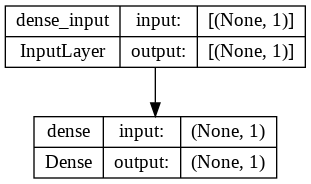

## <div align="center">Model</div>
<p align="center">
 
</p>

---
## <div align="center">Code</div>
**Tesorflow:**

1/ [Basic](https://github.com/dotrannhattuong/Tensorflow_Tutorial/blob/main/Machine_Learning/Linear_Regression/1_TF_LinearRegression_Tape.ipynb)

2/ [Vectorize](https://github.com/dotrannhattuong/Tensorflow_Tutorial/blob/main/Machine_Learning/Linear_Regression/2_TF_LinearRegression_Tape_Theta.ipynb)

**Keras:**

[Code](https://github.com/dotrannhattuong/Tensorflow_Tutorial/blob/main/Machine_Learning/Linear_Regression/3_TF_LinearRegression_Keras.ipynb)

---
## <div align="center">Pipeline</div>

**B1**: Load Data
```
data = np.genfromtxt('data.csv', delimiter=',')
X = data[:, :-1]
y = data[:, -1:]
```

**B2**: Initialize theta
```
## Tensorflow
theta = tf.Variable([[0.04], 
                     [-0.34]], 
                    dtype=tf.float64)

## Keras
model.layers[0].set_weights([np.array([[-0.34]]), np.array([0.04])])
```

**B3**: Khởi tạo Model
```
## Tensorflow
def predict(X, theta):
  return tf.transpose(theta)@X

## Keras
### Cách 1
model = keras.Sequential()
model.add(keras.layers.Input(1,))
model.add(keras.layers.Dense(1))

### Cách 2
model = keras.Sequential(keras.layers.Dense(units=1, input_shape=[1]))

model.summary()
```

**B4**: Đạo hàm - Update weights
```
## Tensorflow
# Gradient
dtheta = tape.gradient(loss, theta)

# Update weights
theta.assign_sub(lr*dtheta)

## Keras
####### Cách 1 #######
model.compile(optimizer='sgd', loss='mean_squared_error')

####### Cách 2 #######
model.compile(optimizer=keras.optimizers.SGD(learning_rate=0.01), loss='mse')

####### Training #######
history = model.fit(X, y, batch_size, epochs)
```

## <div align="center">Note</div>
- Nên sử dụng model.predict(X_testing) để predict vì nếu xài model(X_testing) sẽ phải convert qua numpy -> chuyển từ RAM sang VRAM -> chậm
- Weights save với đuôi .ckpt
- Model save với đuôi .h5 