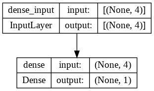

## <div align="center">Model</div>
<p align="center">
 
</p>

---
## <div align="center">Code</div>
**Tesorflow:**

[Basic](https://github.com/dotrannhattuong/Tensorflow_Tutorial/blob/main/Machine_Learning/Logistic_Regression/1.TF_LogisticRegression_Tape)

**Keras:**

[Code](https://github.com/dotrannhattuong/Tensorflow_Tutorial/blob/main/Machine_Learning/Logistic_Regression/2.LogisticRegression_Keras.ipynb)

---
## <div align="center">Pipeline</div>

**B1**: Load Data
```
# Data preparation
data = np.genfromtxt('iris_full.csv', 
                     delimiter=',',
                     skip_header=1)

X = data[:, :4]
y = data[:, -1:]
N = X.shape[0]

X = np.c_[np.ones((N, 1)), X]

# shuffle dataset
inds = np.arange(N)
np.random.shuffle(inds)

X = X[inds]
y = y[inds]
```

**B2**: Initialize theta
```
## Tensorflow
theta = tf.Variable([[0.01],
                     [-0.04], 
                     [0.02], 
                     [-0.03], 
                     [0.001]], dtype=tf.float64)
```

**B3**: Khởi tạo Model
```
## Tensorflow
def predict(X, theta):
  return tf.math.sigmoid(X@theta)

## Keras
model = keras.Sequential([keras.layers.Dense(units=1,
                                             activation='sigmoid',
                                             input_shape=[4])])

model.summary()
```

**B4**: Đạo hàm - Update weights
```
## Tensorflow
# Gradient
dtheta = tape.gradient(loss, theta)

# Update weights
theta.assign_sub(lr*dtheta)

## Keras
opt = keras.optimizers.SGD(learning_rate=0.01)
model.compile(optimizer=opt,
              loss='binary_crossentropy')


####### Training #######
history = model.fit(X, y, batch_size, epochs)
```

## <div align="center">Note</div>
- Nên sử dụng model.predict(X_testing) để predict vì nếu xài model(X_testing) sẽ phải convert qua numpy -> chuyển từ RAM sang VRAM -> chậm
- Weights save với đuôi .ckpt
- Model save với đuôi .h5 