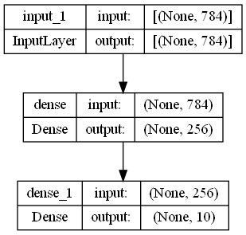

## <div align="center">Model</div>
<p align="center">
 
</p>

---
## <div align="center">Code</div>

[1. MLP Normal](https://github.com/dotrannhattuong/Tensorflow_Tutorial/blob/main/Machine_Learning/MLP/1.MLP_normal.ipynb)

[2. MLP with Custom Layers](https://github.com/dotrannhattuong/Tensorflow_Tutorial/blob/main/Machine_Learning/MLP/2.MLP_custom_layers.ipynb)

[References](https://www.tensorflow.org/tutorials/customization/custom_layers)

---
## <div align="center">Pipeline</div>

**B1**: Prepare Data

```
import numpy as np
import tensorflow as tf
from tensorflow.keras.datasets import fashion_mnist

(x_train, y_train), (x_test, y_test) = fashion_mnist.load_data()

x_train = x_train.astype('float32')
x_test  = x_test.astype('float32')

x_train = x_train.reshape(60000, -1) # x_train = tf.reshape(x_train, (-1, 28*28))
x_test  = x_test.reshape(10000, -1) # x_test = tf.reshape(x_test, (-1, 28*28))

# data normalization

mean = np.mean(x_train)
std  = np.std(x_train)

x_train = (x_train-mean)/std
x_test  = (x_test-mean)/std
```

**B2**: Khởi tạo Model
```
import tensorflow.keras as keras

# Normal
model = keras.Sequential()
model.add(keras.Input(shape=(784,)))
model.add(keras.layers.Dense(256, activation='relu'))
model.add(keras.layers.Dense(10, activation='softmax'))
model.summary()

# Custom Layers
model = keras.Sequential()
model.add(keras.Input(shape=(784,)))
model.add(MyDenseLayer(256))
model.add(MyActivationLayer())
model.add(MyDenseLayer(10))
model.add(tf.keras.layers.Softmax())
model.summary()
```

**B2 (Optional)**: Custom Layers
```
## Custom Activation Layers ##
class MyReluActivation(tf.keras.layers.Layer):
    def __init__(self):
        super(MyReluActivation, self).__init__()

    def call(self, inputs):
        return tf.maximum(inputs, 0)

## Custom Dense Layers ##
class MyDenseLayer(tf.keras.layers.Layer):
    def __init__(self, num_outputs):
        super(MyDenseLayer, self).__init__()
        self.num_outputs = num_outputs

    def build(self, input_shape):
        self.kernel = self.add_weight("kernel",
                                      shape=[int(input_shape[-1]), self.num_outputs])
        self.bias   = self.add_weight("bias",
                                      shape=[self.num_outputs])

    def call(self, inputs):
        return tf.matmul(inputs, self.kernel) + self.bias
```

**B3**: Compile
```
# optimizer and loss
model.compile(optimizer='sgd', 
              loss='sparse_categorical_crossentropy', 
              metrics=['sparse_categorical_accuracy'])


```

**B4**: Training
```
####### Training #######
# training
history = model.fit(x_train, y_train, 
                    validation_data=(x_test, y_test), 
                    batch_size=256, epochs=100, verbose=2)
```

**B5**: Evaluation
```
model.evaluate(x_test, y_test, 256)
```

**B6**: Visualize
```
import matplotlib.pyplot as plt

plt.plot(history.history['sparse_categorical_accuracy'], label='train_accuracy')
plt.plot(history.history['val_sparse_categorical_accuracy'], label='val_accuracy')
plt.xlabel('iteration')
plt.ylabel('Accuracy')
plt.legend()
```

**B8**: # Load model
```
model = keras.models.load_model('/content/models/model_5')
print(model.layers[0].get_weights())
model.summary()
```

## <div align="center">Note</div>
- Có Sparse thì không cần ```one hot encoding```
- Nếu có cả validation_data và validation_split thì nó sẽ ưu tiên validation_data
- Nên sử dụng model.predict(X_testing) để predict vì nếu xài model(X_testing) sẽ phải convert qua numpy -> chuyển từ RAM sang VRAM -> chậm
- Weights save với đuôi .ckpt
- Model save với đuôi .h5 