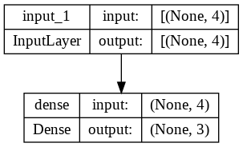

## <div align="center">Model</div>
<p align="center">
 
</p>

---
## <div align="center">Code</div>
**Tesorflow:**

[Basic](https://github.com/dotrannhattuong/Tensorflow_Tutorial/blob/main/Machine_Learning/Softmax/1.TF_Softmax_Tape.ipynb)

**Keras:**

1/ [Training](https://github.com/dotrannhattuong/Tensorflow_Tutorial/blob/main/Machine_Learning/Softmax/2.Softmax_Keras.ipynb)

2/ [Training-Callbacks-Metrics](https://github.com/dotrannhattuong/Tensorflow_Tutorial/blob/main/Machine_Learning/Softmax/3.Softmax_Keras_Training.ipynb)

---
## <div align="center">Pipeline</div>

**B1**: Prepare Data

```
data = np.genfromtxt('iris_full.csv', 
                      delimiter=',', 
                      skip_header=1)
X = data[:,:4]
y = data[:,-1:]
```

`Split Data`
```
# shuffle
inds = np.arange(N)
np.random.shuffle(inds)

x = x[inds]
y = y[inds]

# prepare train and val data
N_train = 120
x_train = x[:N_train]
y_train = y[:N_train]

x_val = x[N_train:]
y_val = y[N_train:]
```

**B2**: Initialize theta
```
## Tensorflow
D = num_features + 1
K = 3

theta = tf.Variable(tf.random.normal((D, K), dtype=tf.float64))
```

**B3**: Khởi tạo Model
```
## Tensorflow
def predict(theta, X):
  return tf.math.softmax(X@theta)

## Keras
model = tf.keras.Sequential()
model.add(tf.keras.Input(shape=(4,)))
model.add(tf.keras.layers.Dense(units=3, activation='softmax'))

model.summary()
```

**B4**: Compile
```
## Tensorflow
# gradient
dtheta = t.gradient(loss, theta)

# update
theta.assign_sub(lr*dtheta)

## Keras
####### Không có one_hot_encoding #######
model.compile(optimizer='sgd',
              loss='sparse_categorical_crossentropy')

####### Có one_hot_encoding #######
model.compile(optimizer='sgd', 
              loss='categorical_crossentropy')

####### Metrics #######
model.compile(optimizer='sgd', 
              loss='sparse_categorical_crossentropy',
              metrics=[keras.metrics.SparseCategoricalAccuracy()])
```

**B5**: Training
```
####### Training #######
history = model.fit(X, y, batch_size, epochs)

####### Training-Validation-Data Cách 1 #######
# Nếu có cả validation_data và validation_split thì nó sẽ ưu tiên validation_data
history = model.fit(x_train, y_train, batch_size,
                    validation_data=(x_val, y_val),
                    validation_split=0.4,
                    epochs=epochs, verbose=2)

####### Training-Validation-Data Cách 2 #######
history = model.fit(x_train, y_train, batch_size,
                    validation_data=(x_val, y_val),
                    epochs=epochs, verbose=2,
                    callbacks=callbacks)

                
####### Training-Callbacks #######
callbacks = [
    keras.callbacks.ModelCheckpoint(
        filepath="/content/models/model_{epoch}",
        save_best_only=True,
        monitor="val_loss",
        verbose=1
    )
]

history = model.fit(x_train, y_train, batch_size,
                    validation_data=(x_val, y_val),
                    epochs=epochs, verbose=2,
                    callbacks=callbacks)
```

**B6**: Evaluation
```
####### Cách 1 ######
model.evaluate(x_val, y_val, batch_size, verbose=2)

####### Cách 2 ######
preds = model(X)
preds = preds.numpy()
predicted_class = np.argmax(preds, axis=1)

acc = np.mean(predicted_class == y)
print(acc.mean())
```

**B7**: Visualize
```
import matplotlib.pyplot as plt

plt.plot(history.history['loss'])
plt.xlabel('iteration')
plt.ylabel('Loss')
plt.show()
```

**B8**: # Load model
```
model = keras.models.load_model('/content/models/model_5')
print(model.layers[0].get_weights())
model.summary()
```

## <div align="center">Note</div>
- Nếu có cả validation_data và validation_split thì nó sẽ ưu tiên validation_data
- Nên sử dụng model.predict(X_testing) để predict vì nếu xài model(X_testing) sẽ phải convert qua numpy -> chuyển từ RAM sang VRAM -> chậm
- Weights save với đuôi .ckpt
- Model save với đuôi .h5 